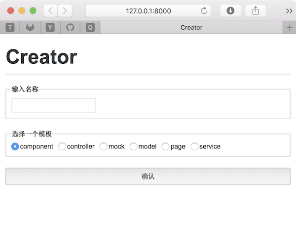

# dn-middleware-mobx-react-creator

与 [dn-template-mobx-react](https://www.npmjs.com/package/dn-template-mobx-react) 模板配套使用的模板文件生成器，可以通过命令行或者网页客户端来生成模板文件。

## 一、添加使用配置

在 `.dawn/pipe.yml` 文件中加入以下配置：
```sh
create:
  - name: mobx-react-creator
```

## 二、使用 GUI 生成模板文件

执行以下命令启动 gui：

```sh
$ dn run create
```




## 三、使用命令行生成模板文件

修改成以下配置：

```sh
create:
  - name: mobx-react-creator
    gui: false
```

执行命令：

```sh
$ dn run create
```

出现如下的选择菜单，选择一个要生成模板类型，然后，按照提示操作就行。

```sh
? 选择一个模板： (Use arrow keys)
❯ 1.component
  2.controller
  3.mock
  4.model
  5.page
  6.service
```